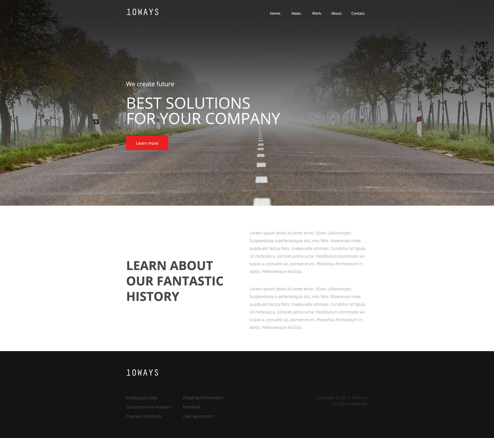

# Zaawansowany HTML i CSS &ndash; egzamin

## Stwórz stronę na podstawie poniższych wytycznych:

**Wytyczne dotyczące repozytorium**

1. Stwórz [**fork**][forking]  repozytorium z tym egzaminem.
2. [**Sklonuj**][ref-clone] repozytorium na swój komputer.
3. Gdy skończysz [**skomituj**][ref-commit] zmiany do swojego repozytorium.
4. [**Wypchnij**][ref-push] zmiany do swojego repozytorium na GitHubie.
5. [Stwórz **pull request**][pull-request] do oryginalnego repozytorium, gdy skończysz zadanie.

Zmiany wprowadzaj w następujących plikach:
* **index.html**,
* **style.css**.

**Wytyczne dotyczące projektu**
* Font użyty w projekcie to **Open Sans**,
* Wszystkie potrzebne obrazki są wycięte i umieszczone w katalogu `images`,
* Szerokość strony &ndash; `930px`,
* Wielkości i kolory fontu:
	* **menu**: `14px`, `white`,
	* **tekst w headerze**: `24px` i `60px`, `white`,
	* **button w headerze**: `16px`, `white` (kolor buttona: `#e92121`),
	* **Tekst w contencie**:
		* lewa strona &ndash; `48px`, `#464646`,
		* prawa strona &ndash; `16px`, `#b7b7b7`,
	* **menu w stopce**: `16px`, `#474747`,
	* **copyright w stopce**: `16px`, `#353434`.

## Potrzebujesz pomocy?
* [FontSquirel &ndash; Open Sans](http://www.fontsquirrel.com/fonts/open-sans)

<!-- Links -->
[forking]: https://guides.github.com/activities/forking/
[ref-clone]: http://gitref.org/creating/#clone
[ref-commit]: http://gitref.org/basic/#commit
[ref-push]: http://gitref.org/remotes/#push
[pull-request]: https://help.github.com/articles/creating-a-pull-request
